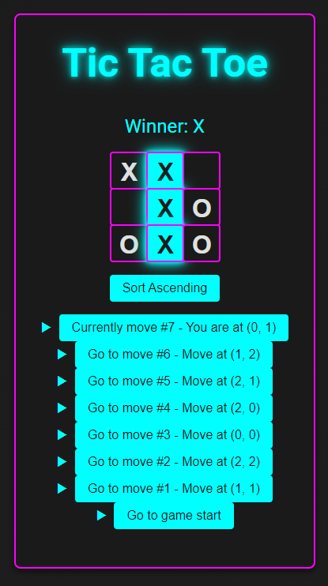

# Tic-Tac-Toe Game

This is a simple Tic-Tac-Toe game project created to learn React and Vite. The project follows the [React tutorial](https://react.dev/learn/tutorial-tic-tac-toe) to build a basic Tic-Tac-Toe game.

## Features

- Interactive game board
- Responsive design for mobile devices
- Cyberpunk-themed styling with neon pink and blue colors

## Installation

1. Clone the repository:

   ```sh
   git clone https://github.com/yourusername/tictactoe-app.git
   ```

2. Navigate to the project directory:

    ```sh
    cd tictactoe-app
    ```

3. Install the dependencies:

    ```sh
    npm install
    ```

4. Start the development server:

    ```sh
    npm run dev
    ```

## Usage

Open your web browser and navigate to [http://localhost:3000](http://localhost:3000) to play the game.

## Screenshots



## License

This project is licensed under the MIT License.